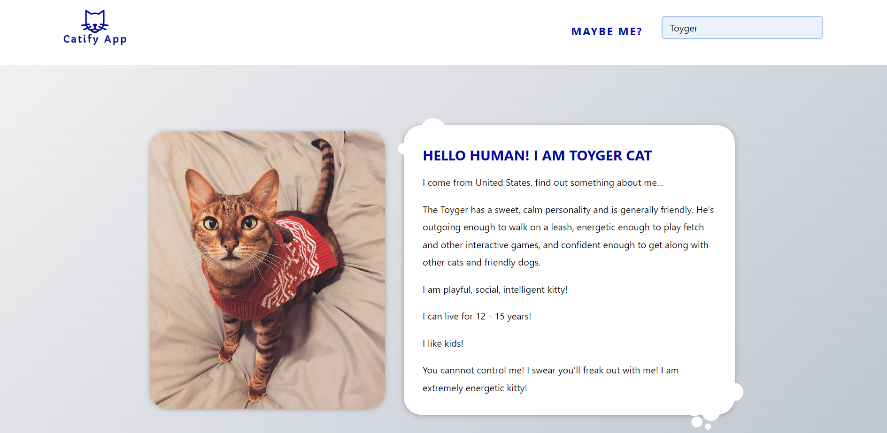

## Catify App!

**[Catify](https://catify-api.netlify.app/)** is a cat-lover app, which is based on a public API titled "The cat api", which allows a user to select a particular cat breed.

---

## What I used

- simple JS
- fetch/await/async 
- try and catch validation
- breed selector
- plain styles
- a responsive and user-friendly design

---

**Here are the links to Catify App:**

You can check it out live - **<https://catify-api.netlify.app/>**
or look into the code here on GitHub - **<https://github.com/romaniso/Catify/>**